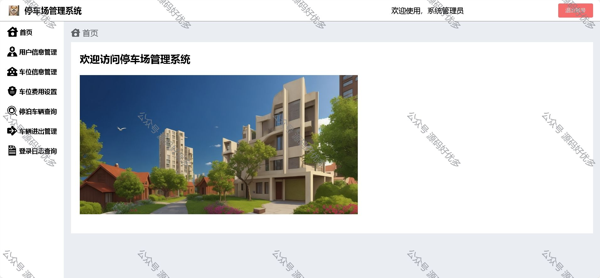
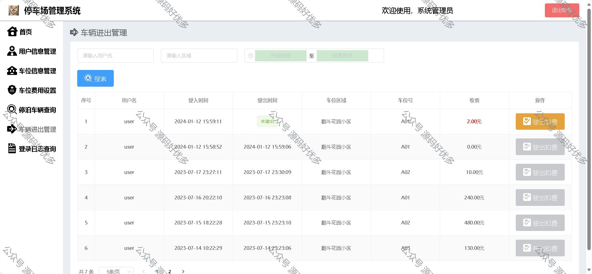
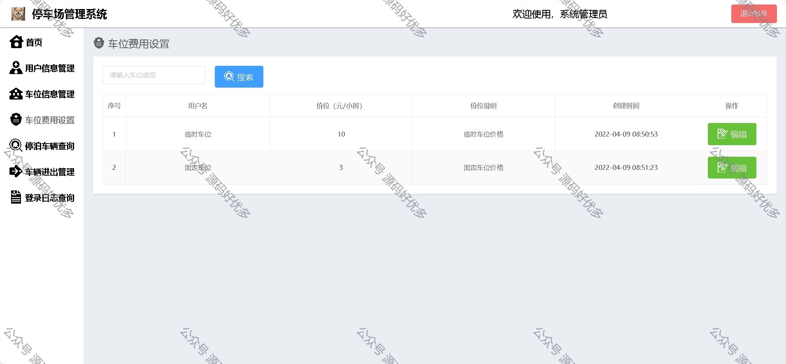
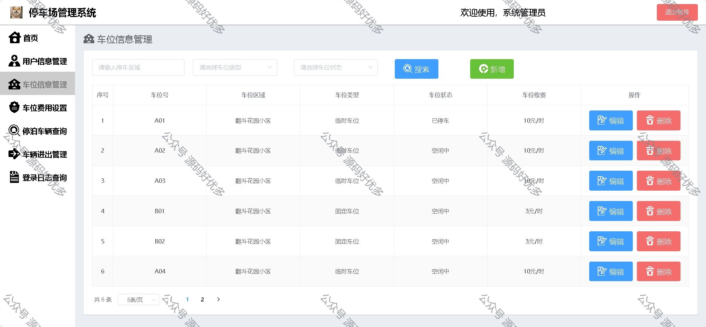
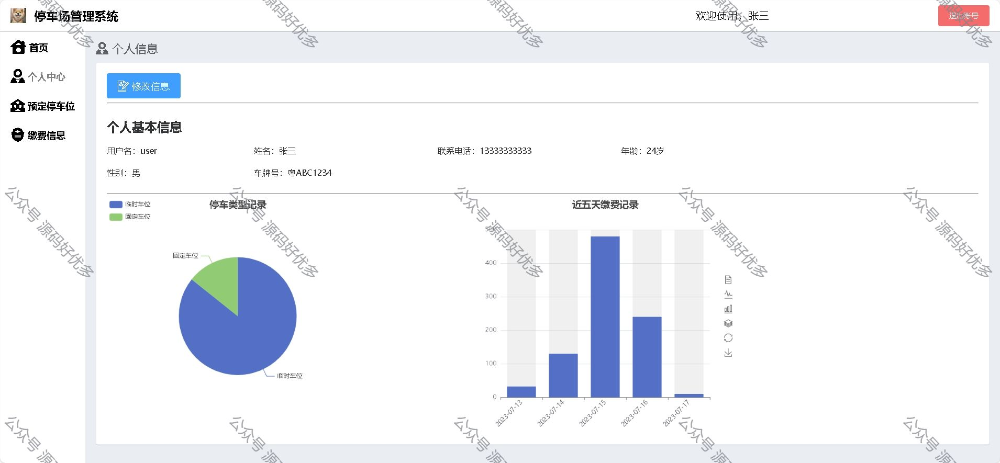
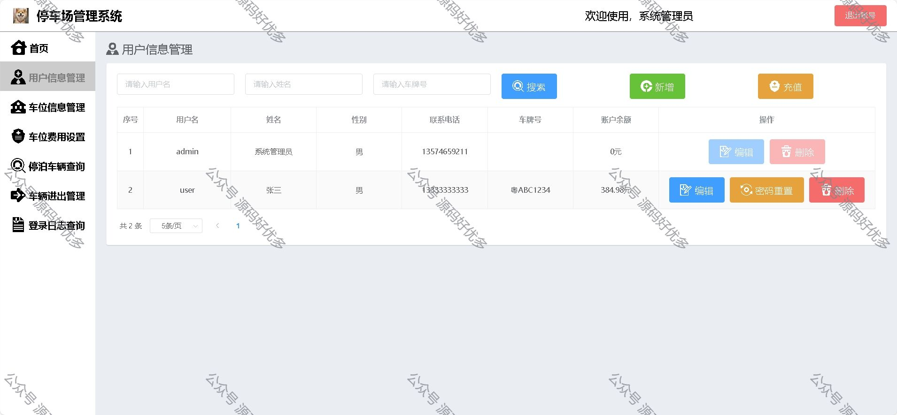

### 一、作品包含

源码+数据库+设计文档+全套环境和工具资源+部署教程

### 二、项目技术

前端技术：Html、Css、Js、Vue、Element-ui

数据库：MySQL

后端技术：Java、Spring Boot、MyBatis

### 三、运行环境

开发工具：IDEA/eclipse

数据库：MySQL8.0

数据库管理工具：Navicat10以上版本

环境配置软件： JDK1.8+Maven3.6.3

前端Nodejs：16

### 四、项目介绍

项目编号：springbootA010
随着信息技术的不断发展和普及，人们对停车服务的需求也在不断增加。现代社会中，人们对停车服务的要求不仅仅停留在停车位的数量和收费标准，更加注重停车体验和服务质量。因此，设计一款智能化、便捷高效的停车场管理系统，成为提升城市交通管理水平和满足人们停车需求的重要途径。本项目的背景正是基于这一现实需求，旨在通过系统的设计和开发，改善停车场管理效率，提升用户体验，为城市交通发展和管理做出积极贡献
管理员功能模块：
登录、用户信息管理、车位信息管理、车位费用管理、停泊车辆查询、车辆进出管理、登录日志查询

用户功能模块：
登录注册、个人中心、饼状统计图，以及近五天的缴费记录的柱状图；
预订停车位：用户可以预订停车位，选择停车时间和车位类型；
缴费信息：用户可以进行充值操作，以及进行停车缴费操作，实现停车费用的支付。

### 五、运行截图

